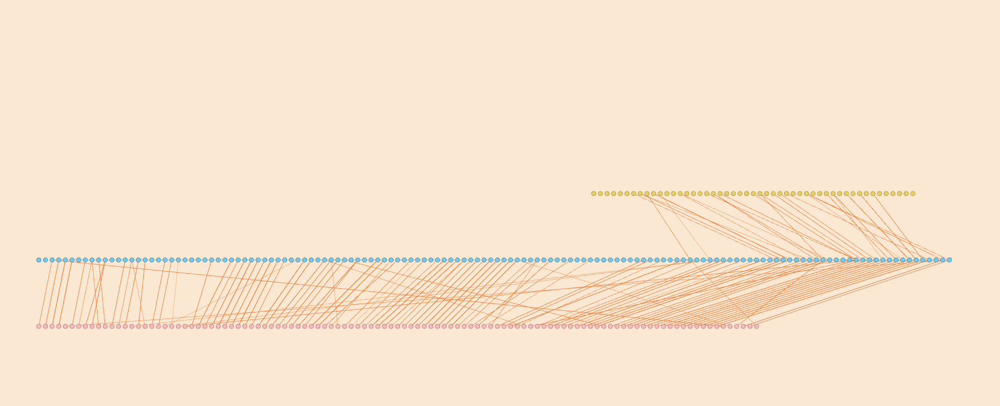

# CinderellaDiscourseAnalysis
a prototype for discourse analysis on 500 versions of cinderella, and 497 more to go...

_download the .html file to interact with Cinderellas🧚🏻‍♀️_
# Resources
1. Gutenberg Project
2. Narrative representation models
   1. [Pretrained framenet transformer](https://github.com/chanind/frame-semantic-transformer)
   2. [UTC](https://github.com/PaddlePaddle/PaddleNLP/blob/466872bd72a11c6d548d530c50dbda1ac6354dfe/paddlenlp/transformers/ernie/modeling.py#L1286)

# Installation
### Requirements
- frame-semantic-transformer
- gutenberg 
- clean-text 
- paddlenlp 
- fastcoref

Note: In order to install gutenberg, you will need a local version of `berkeley-db` installed in the system. 
For more information regarding platform-specific installation, please visit the gutenberg project [homepage](https://pypi.org/project/Gutenberg/).

For MacOS, here are the steps:
```
brew install berkeley-db4
BERKELEYDB_DIR=$(brew --prefix berkeley-db@4) pip install bsddb3
pip install -r requirements.txt
```


# Idea
As a fast proof-of-concept, the goal here is to see how different versions of Cinderella differ from each other on a discourse level (how a story is told), where stories (or events) are represented as frames. Generative models will be used to generate frames. 

1. Discourse analysis: Temporality of events and Cinderella ...  
2. Summarization through core event mining of various narratives
3. Media biases study


[//]: # (If meaningful findings are discovered, then it makes sense to go beyond FrameNet -> proper event extraction)

[//]: # (Another potential of this is to use a CLIP-like architecture with contrastive pre-training to map both raw text and KGs onto the same space to allow unsupervised text-KG conversion or another way around. )
